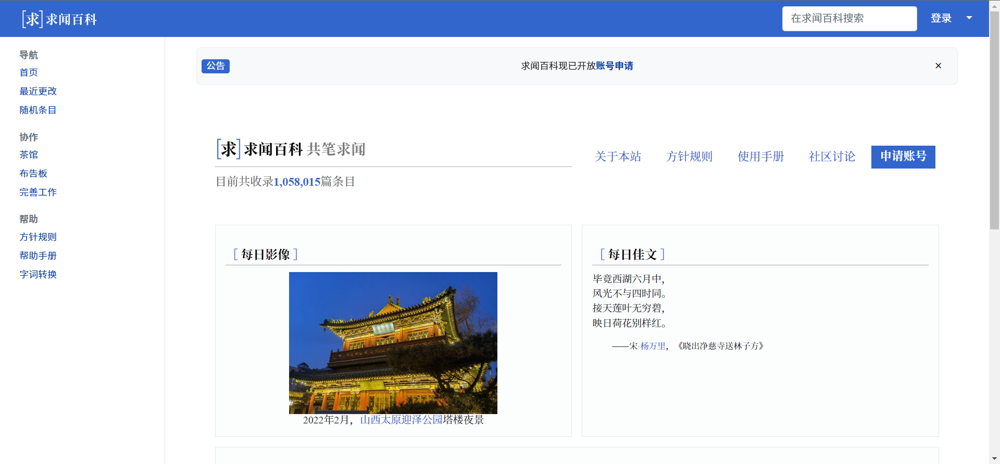

# Write

_A MediaWiki skin based on Bootstrap 4._

## Installation

* Download and place the file(s) in a directory called Write in your `skins/`
  folder.
* Add the following code at the bottom of your `LocalSettings.php`:

      wfLoadSkin( 'Write' );

* Done - Navigate to `Special:Version` on your wiki to verify that the skin is
  successfully installed.

## Customization

### Global settings

#### Theme color

It is possible to set the color theme by inserting `$wgWriteColor` to your
`LocalSettings.php`:

    $wgWriteColor = '#FF0000';

Possible values are either hex values of HTML colors, or named values as used
in CSS.

    $wgWriteColor = 'blue';

Default value is `#3366cc` as used in Qiuwen Baike.

#### Site logo

By default, the site logo is not shown at all. But if you want to show your
logo with this skin, you can place it:

* in the upper main bar next to the site title,
* in the sidebar as usual in other skins like Monobook, Vector.

You just have to set `$wgWriteShowLogo` in your `LocalSettings.php`:

    $wgWriteShowLogo = 'main';    // for a small logo (28×28 px) in the main bar
    $wgWriteShowLogo = 'sidebar'; // for big logo in the sidebar

But don't forget to set the logo path at `$wgLogo`!

The default value is `'none'`.

Additionaly, if you have `$wgWriteShowLogo = 'main';`, you can specify these:

    // use only logo without text (i.e. without site name)
    $wgWriteUseLogoWithoutText = true;

#### Responsive skin

Note that this skin is responsive by default, i.e. it fits the screen both on
desktops and on mobile screens. If you need unresponsive design, just set in
`LocalSettings.php`:

    $wgWriteResponsive = false;

#### Content width

You can set the content width with `$wgWriteContentWidth`, which has four
options:

* `default`
* `full`
* `narrow`
* `wide`

At large screens, the main content container (with articles, texts, etc.) is
9/12 of the screen width and sidebar menu takes 2/12 of the screen width. It
means that 1/12 of the screen width on the right side remains white. This is
the default and looks good.

But there can be cases when you need your wiki to extend to the full width of
the screen even on the large screens. Then you can use `$wgWriteContentWidth`
variable in your `LocalSettings.php` and set that to `full`:

    $wgWriteContentWidth = 'full';

Then the main content container will take 10/12 of the screen width (and 2/12
remain for the sidebar menu).

If you want a narrow main content (i.e. 8/12 for the main content, 2/12 for
the sidebar on the left and 2/12 for the white space on the right), use
`narrow`:

    $wgWriteContentWidth = 'narrow';

If you need a wide main content with a narrow left sidebar, use `wide`. Then
the sidebar will be 1/12 and the main content 10/12:

    $wgWriteContentWidth = 'wide';

### User settings

#### Basic font size

Every user is able to change the default font size in their user settings. It's
found in `Special:Preferences` under the skin preferences.

## Contributing

You can contribute to the git repository:

    https://git.qiuwen.wiki/qiuwen/Write

## License

Originally created at 1st Faculty of Medicine, Charles University and maintained
by Petr Kajzar, 2019–2022.

Modified by Qiuwen Baike Contributors, since 2022.

This skin is:

* based on [Skin:Example](https://www.mediawiki.org/wiki/Skin:Example)
  (provided under CC0 license),
* using [Bootstrap](https://getbootstrap.com/) v4.6.0 (provided under MIT license),
* using [popper.js](https://popper.js.org/) v1.16.1 (provided under MIT license),
* created for [WikiSkripta](https://www.wikiskripta.eu) medical wiki,
* and released under Creative Commons Zero v1.0 Universal license.

This software is distributed without any warranty.

For additional info please refer to the [COPYING file](COPYING).
